# 01 · System Context

How SAM relates to the user, their devices, and external systems. This is the highest-level view — zoom in via the container diagram.

```mermaid
flowchart TB
    user(("Sarah<br/>WFG Strategist"))

    subgraph macOS["macOS 26+ (Tahoe) Mac"]
        SAM["<b>SAM (Mac app)</b><br/>SwiftUI + SwiftData<br/>Coaching + BI"]
        Apple["Apple System Apps<br/>Contacts · Calendar · Mail<br/>iMessage · Phone · FaceTime"]
        Mail_DB[("Mail Envelope<br/>Index SQLite<br/>(read direct)")]
    end

    subgraph iPhone["iPhone (iOS 26+)"]
        SAMField["<b>SAMField</b><br/>Voice capture<br/>Trip tracking<br/>Briefing"]
    end

    subgraph LocalAI["On-device AI"]
        FM["FoundationModels<br/>(default)"]
        MLX["MLX local<br/>(strong reasoning)"]
        Whisper["Whisper<br/>(transcription)"]
    end

    subgraph External["External (read-only)"]
        LinkedIn["LinkedIn<br/>(ZIP export)"]
        Facebook["Facebook<br/>(ZIP export)"]
        Substack["Substack<br/>(ZIP export)"]
        Evernote["Evernote<br/>(ENEX)"]
        WFG["WFG back-office<br/>(future)"]
    end

    subgraph Sync["Local Sync (no cloud AI)"]
        TCP["TCP/HMAC<br/>same-LAN stream"]
        CK["CloudKit private DB<br/>(briefing, trips, pairing)"]
    end

    user -->|interacts| SAM
    user -->|interacts| SAMField
    SAM <-->|reads/enriches| Apple
    SAM -.->|reads SQLite| Mail_DB
    SAM <-->|inference| FM
    SAM <-->|inference| MLX
    SAM <-->|transcribe| Whisper
    SAM <-.->|imports ZIPs| LinkedIn
    SAM <-.->|imports ZIPs| Facebook
    SAM <-.->|imports ZIPs| Substack
    SAM <-.->|imports ENEX| Evernote
    SAM -. future .-> WFG
    SAM <-->|recordings, trips| TCP
    SAMField <-->|recordings, trips| TCP
    SAM <-->|briefing, pairing token| CK
    SAMField <-->|briefing, pairing token| CK

    classDef sam fill:#0a84ff,color:#fff,stroke:#0a84ff
    classDef apple fill:#1d1d1f,color:#fff,stroke:#1d1d1f
    classDef ai fill:#5e5ce6,color:#fff,stroke:#5e5ce6
    classDef external fill:#8e8e93,color:#fff,stroke:#8e8e93
    classDef sync fill:#34c759,color:#fff,stroke:#34c759
    class SAM,SAMField sam
    class Apple,Mail_DB apple
    class FM,MLX,Whisper ai
    class LinkedIn,Facebook,Substack,Evernote,WFG external
    class TCP,CK sync
```

## What this diagram shows

- **SAM never talks to cloud AI.** All inference is on-device (Foundation, MLX, Whisper).
- **Apple Contacts/Calendar are systems of record** — SAM reads + enriches via `PendingEnrichment`, never overwrites without explicit approval.
- **Mail integration is direct SQLite** (Envelope Index) — never AppleScript. See memory `feedback_mail_direct_db.md`.
- **Two sync paths to phone**: TCP/HMAC for bulk recordings (same LAN), CloudKit for small durable state (briefing JSON, trips, pairing tokens).
- **Social platforms are read-only ZIP exports** — handled by per-platform import coordinators with auto-detection (see context.md §5.7).

## What this diagram does not show

- Internal architecture — see [02-container-components.md](02-container-components.md).
- The shape of the data — see [03-data-models.md](03-data-models.md).
- How a single recording or note flows through SAM — see [04-flows-recording.md](04-flows-recording.md), [05-flows-note-to-outcome.md](05-flows-note-to-outcome.md).
