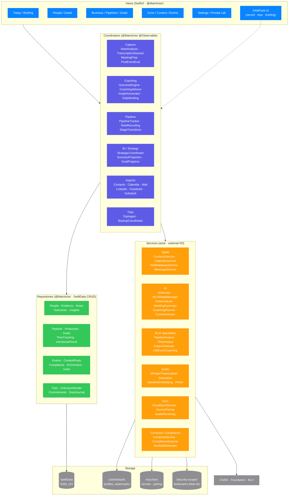
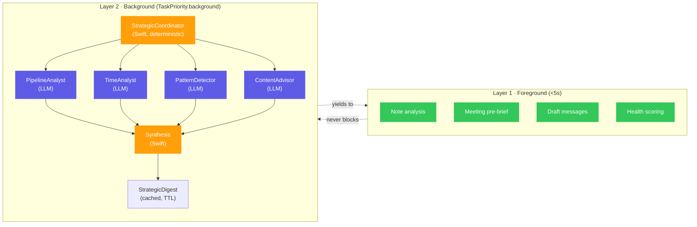

# 02 · Containers & Components

SAM's internal architecture: layers, key coordinators, and the boundaries between them.

## Layered architecture

## Boundary rules

| Layer | Concurrency | What it can do | What it cannot do |
|---|---|---|---|
| **Views** | `@MainActor` (implicit) | Render DTOs / `@Observable` coordinators | Touch raw `CNContact`, `EKEvent`, or SwiftData models directly |
| **Coordinators** | `@MainActor @Observable` | Orchestrate flows, hold UI state, call services + repos | Block the main thread on I/O or AI |
| **Services** | `actor` | Wrap external APIs (Apple, AI, network) | Hold UI state or `@MainActor` references |
| **Repositories** | `@MainActor` | SwiftData CRUD against `SAMModelContainer.shared` | Make external calls |
| **Across boundaries** | — | Pass `Sendable` DTOs only | No `nonisolated(unsafe)` |

## Two-layer AI, RLM-orchestrated

**Why this structure**: Each specialist sees only its slice of pre-aggregated data (<2000 tokens). All numerical math happens in Swift, not the LLM. The coordinator resolves conflicts deterministically. See `CLAUDE.md` for the full RLM rationale.

## Key cross-cutting services

- **`SAMModelContainer.shared`** — the single SwiftData container. All repos read/write through it.
- **`ContactsService` / `CalendarService`** — only place `CNContactStore`/`EKEventStore` instances are created.
- **`AIService` / `MLXModelManager`** — gate all model calls; serialize on unified-memory Macs (see memory `feedback_parallel_inference_jobs.md`).
- **`CalibrationService`** — tracks per-kind act/dismiss/rating to adapt outcome weighting.
- **`RetentionService`** — destroys raw audio + verbatim transcripts after derived outputs are confirmed (compliance).

## See also

- [03-data-models.md](03-data-models.md) — what the repositories store.
- [06-flows-rlm-orchestration.md](06-flows-rlm-orchestration.md) — RLM call graph in detail.
