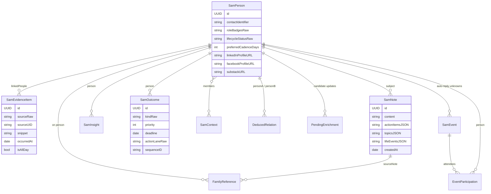
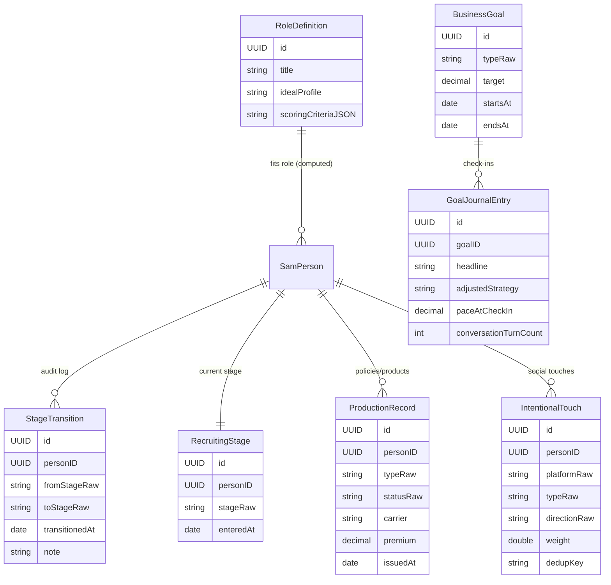
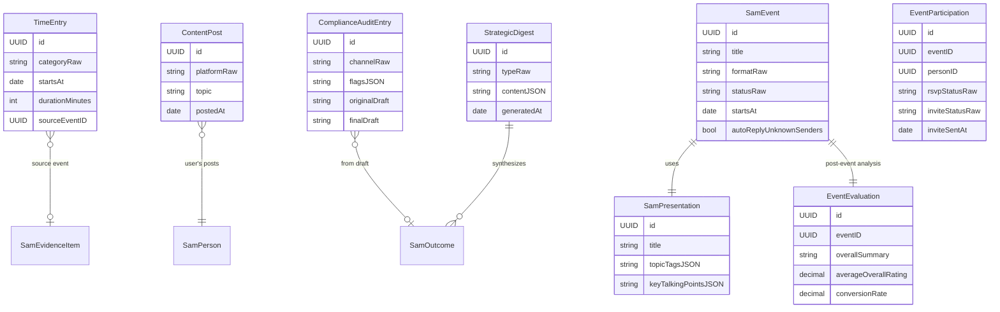
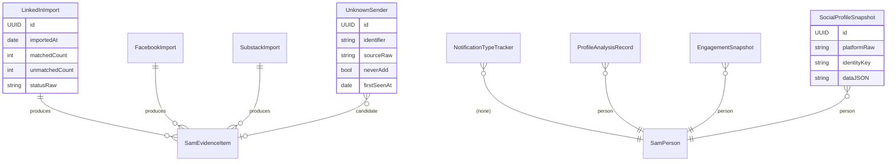
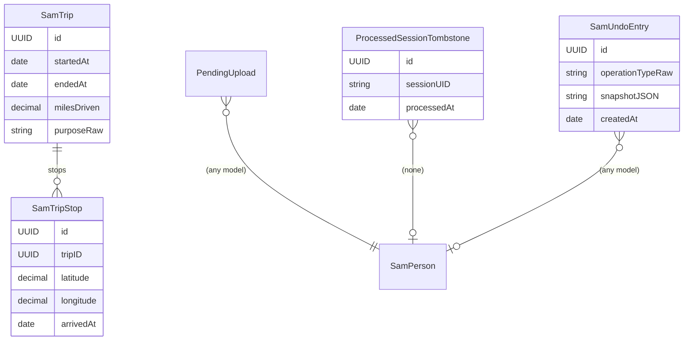

# 03 · Data Models

SwiftData schema **SAM_v34**. Models grouped by domain. Mermaid ER syntax shows only the relationships and a few load-bearing fields — see `SAMModels-*.swift` for full definitions.

## People & evidence (the relationship core)

## Pipeline, recruiting, production (the business core)

## Time, content, compliance, events

## Imports & social

## Mac↔phone sync, trips, undo

## Where things live (non-SwiftData)

| Storage | What's there |
|---|---|
| **UserDefaults** | `UserLinkedInProfileDTO`, `UserFacebookProfileDTO`, `UserSubstackProfileDTO`; per-platform watermarks (`sam.{platform}.lastImportDate`); gap answers (`sam.gap.*`); compliance prompt overrides; text scale; pairing flags |
| **Keychain** | Pairing secrets, mail account credentials |
| **Security-scoped bookmarks** | Mail Envelope Index directory, security-imported file paths |
| **Disk (sandbox)** | Audio segments (pre-retention sweep), backup archives (`SAMENC1` AES-256-GCM), ENEX export staging |
| **CloudKit private DB** | Daily briefing snapshot, trips, pairing token (see `project_cloudkit_pairing_migration.md`) |

## Core invariants

- **Apple Contacts is the system of record**. `SamPerson.contactIdentifier` links to it; standalone records (social-only) have `contactIdentifier == nil`.
- **Every model uses raw-string enum storage** with `@Transient` computed property (Swift 6 + SwiftData limitation).
- **Stage transitions are immutable** — never updated, only inserted. They power velocity and stall detection.
- **Evidence has a dedup key** in `sourceUID` (e.g. `linkedin:msg:12345:1709...`) — re-imports are idempotent.
- **`isArchived`** survives as a `@Transient` computed property; storage column is `isArchivedLegacy` (preserved for backward-compatible migration).

## Schema history

See [context.md §8](../context.md) for the v16 → v34 changelog. New schema versions require lightweight migration; never rename columns destructively.
