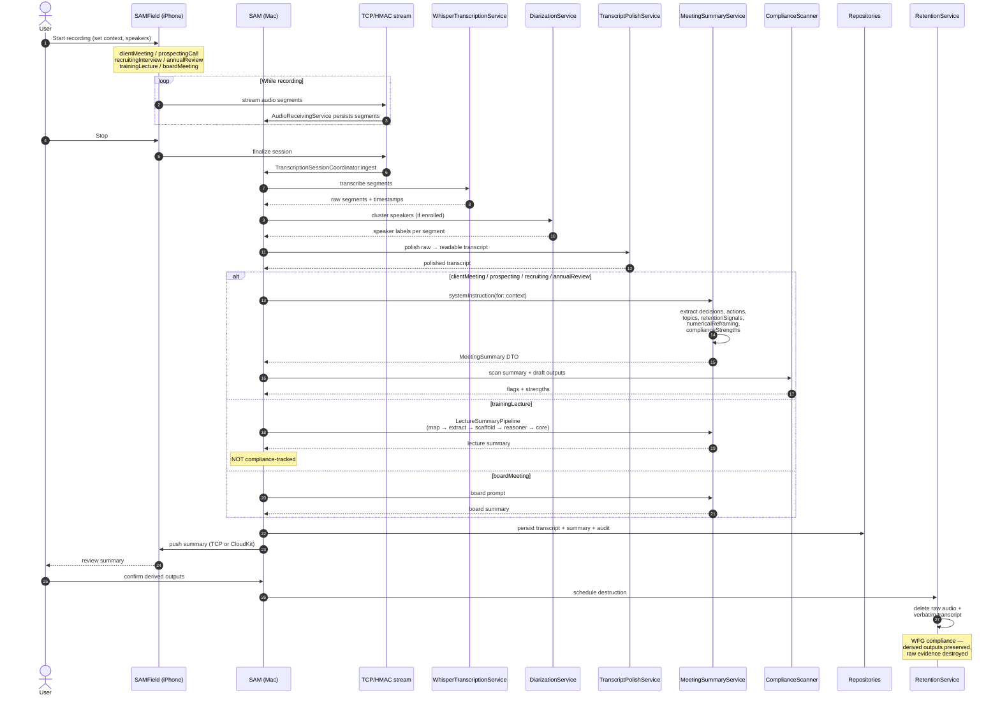

# 04 · Recording → Summary Flow

End-to-end lifecycle of a meeting recording from capture (phone or Mac) to compliance-tracked summary, including post-confirmation retention sweep.

## Sequence

## Notable behaviors

- **Recording context drives the prompt**: each `RecordingContext` case routes to a dedicated `MeetingSummaryService.systemInstruction(for:)` branch validated in `sam-bench`. Per-context overrides live in `sam.ai.{context}SummaryPrompt` UserDefaults.
- **Lecture pipeline is map-then-synthesize**: chunked extraction → deterministic scaffold → reasoner → core → details. Falls through to legacy `refineLectureSummary` on failure so the user always gets *something*. Median 88% on anchor rubrics.
- **Compliance fields are auditable**: `retentionSignals` (verbatim quotes about consulting another advisor or surrendering), `numericalReframing` ("8-10% revised to 5-6%"), `complianceStrengths` (hedging, refusals-to-guarantee). These add +16pp recall on client-meeting scenarios vs. plain decisions/actions/topics.
- **Retention sweep is mandatory**: WFG policy says don't record. SAM destroys raw audio + verbatim transcript after the user confirms the derived outputs. See memory `project_compliance_data_lifecycle.md`.
- **Long recordings need chunking**: a 73-min recording exceeds Apple Intelligence's 4096-token limit for polish + summary — see memory `feedback_context_window_overflow.md`.
- **Sync paths**: bulk audio over TCP/HMAC same-LAN; final summary can also sync via CloudKit (briefing path) for off-LAN review.

## See also

- [05-flows-note-to-outcome.md](05-flows-note-to-outcome.md) — how confirmed summaries feed evidence and outcomes.
- [09-state-recording.md](09-state-recording.md) — recording session state machine.
