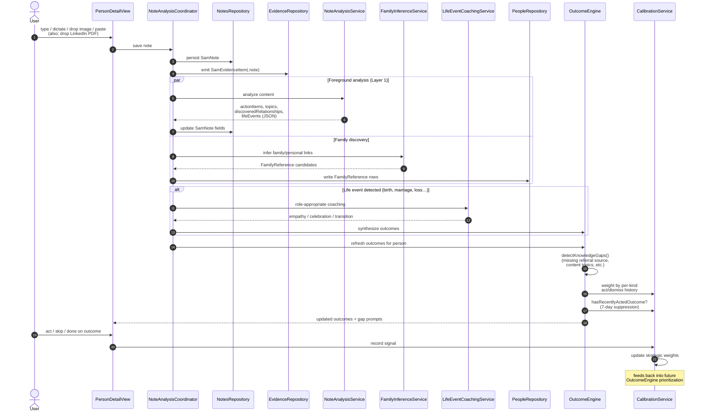

# 05 · Note → Analysis → Outcome Flow

How a saved note becomes evidence, insights, and actionable coaching outcomes — including life event detection and family/relationship discovery.

## Sequence

## Why this flow matters

- **Notes are evidence-first**. A saved note immediately becomes a `SamEvidenceItem` so it's visible in interaction history and contributes to relationship health — even before AI analysis finishes.
- **Foreground only**. All of this runs on `@MainActor` with `<5s` budget. If analysis takes longer (e.g., long dictation), the UI shows a "cogitating" indicator and streams partials.
- **Knowledge gaps are inline, not vague**. When SAM lacks data to be specific (no referral source on a recent client, no posting cadence, etc.), it shows a single `InlineGapPromptView` above the outcome cards. Answers feed `gapAnswersContext()` into future drafts. Max 1 gap shown at a time.
- **Calibration is per-kind**. Every `SamOutcome.kind` accrues its own act/dismiss/rating stats in the `CalibrationLedger`. Muted kinds disappear; soft-suppressed kinds get deprioritized; engaging kinds get boosted. The user can review this in **Settings → "What SAM Has Learned"**.
- **Outcome dedup respects user choices**. `OutcomeRepository.hasRecentlyActedOutcome()` blocks regeneration of dismissed/done outcomes for 7 days; the 24-hour active-duplicate window remains for pending/inProgress.
- **LinkedIn PDF dropped on the note bar** runs through `LinkedInPDFParserService` (deterministic, no AI) — creates `PendingEnrichment` rows + a synthesized note that *then* triggers this same flow for relationship discovery.

## See also

- [02-container-components.md](02-container-components.md) — where `OutcomeEngine` and `CalibrationService` sit.
- [06-flows-rlm-orchestration.md](06-flows-rlm-orchestration.md) — how the *background* layer reasons across all outcomes for the strategic digest.
