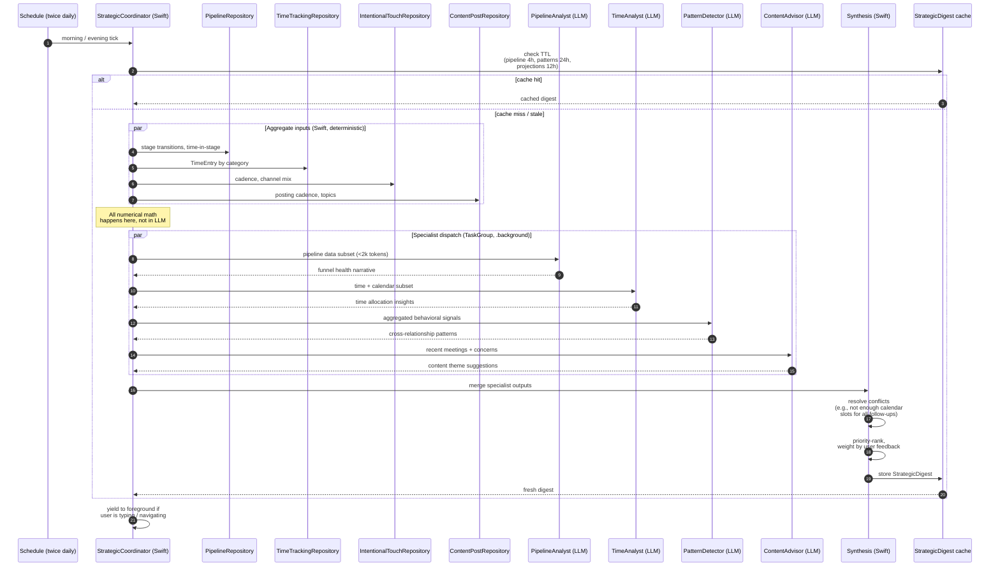

# 06 · RLM Orchestration (Strategic Coordinator)

How SAM reasons across the *entire* business state without overflowing on-device LLM context. This is the Recursive Language Model pattern adapted for local inference: decompose, dispatch, synthesize.

## Sequence

## Why decompose

A single LLM call reasoning over 50+ relationships, all pipeline stages, production records, time data, and market context produces unreliable output: context overflow, hallucinations, slow inference. By giving each specialist a small focused window (<2000 tokens) and letting Swift handle all numbers, SAM gets reliable narration *and* deterministic math.

## Specialist contracts

| Specialist | Input (curated subset) | Output |
|---|---|---|
| **PipelineAnalyst** | StageTransition log, time-in-stage metrics, conversion history | Funnel health assessment, stalled-applicant call-outs |
| **TimeAnalyst** | TimeEntry by category, calendar categorization | Selling vs. admin ratio, time allocation recommendations |
| **PatternDetector** | Aggregated behavioral signals (NOT raw evidence) | Cross-relationship correlations ("Tuesday afternoons +40% follow-through") |
| **ContentAdvisor** | Recent meeting topics, client concerns | Educational content themes |
| **LifeEventCoaching** | Detected life events with role context | Empathy/celebration/transition coaching |
| **RoleCandidateAnalyst** | RoleDefinition + candidate evidence | Candidate scoring + recruiting outreach |

## Hard rules

- **Specialists never see raw evidence text** — only pre-aggregated signals. Privacy + token budget.
- **No specialist computes a number**. All counts, ratios, projections are Swift. The LLM interprets and narrates.
- **Conflict resolution is deterministic**. If three specialists each recommend a follow-up call but only two free calendar slots exist, the synthesis layer ranks by priority + calibration weight and drops the rest.
- **Self-refinement loop**. Generated recommendations are evaluated against the user's historical act/dismiss patterns *before* surfacing — see `CalibrationService`.
- **TaskPriority.background + Task.yield()** — never starve the foreground. Pause entirely under thermal pressure or active typing.
- **Cache with TTL**. Pipeline analysis 4h, patterns 24h, projections 12h. Recompute only when the underlying signals change materially.

## Outputs

The synthesized `StrategicDigest` flows into:
- The **Today / morning briefing** (top 3–5 recommendations)
- The **weekly strategic digest** (synthesized business health report)
- The **Business** dashboard ("Last updated: [timestamp]")
- **Goal pacing** (when goals exist, the coordinator decomposes targets into weekly/daily pacing)

See memory `project_business_growth_drivers.md` — Sarah's two equally weighted drivers (new revenue AND referrals/prospect generation) must both be reflected in the digest, not just revenue.
