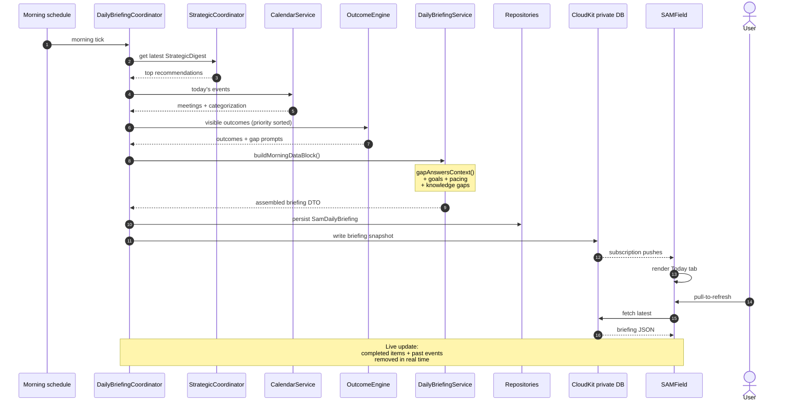

# 07 · Daily Briefing Generation + Phone Sync

How the morning briefing is assembled on the Mac and synced to SAMField for read on the go.

## Sequence

## What the briefing contains (all DTOs in coordinators, never in views)

- **Strategic highlights** — top 3–5 from the latest `StrategicDigest`.
- **Today's calendar** — categorized events with prep/follow-up cues.
- **Visible outcomes** — high-priority `SamOutcome` rows; suppressed for muted kinds; deduped against recent acts/dismisses.
- **Knowledge gaps** — at most one inline gap prompt.
- **Goals + pacing** — current `BusinessGoal` progress, pace, and any `GoalJournalEntry` learnings.
- **Crash-recovery banner** (if last session crashed) — `CrashReportService` data.

## Sync paths

| Path | What flows | When |
|---|---|---|
| **CloudKit private DB** | Briefing snapshot, trips, pairing token | Always available, even off-LAN |
| **TCP/HMAC same-LAN** | Bulk recordings, audio segments | When phone is on same Wi-Fi |

The briefing intentionally goes through CloudKit so the phone shows the latest morning briefing regardless of LAN status. See memory `project_briefing_sync.md`.

## Live update behavior

Per memory `feedback_briefing_live_update.md`: completed outcomes and past events must drop from the briefing in real time, not on next refresh. Coordinators observe repository changes and republish.

## Pairing

Same-iCloud-account device trust uses CloudKit private DB to distribute the pairing token — no PIN/QR UX. See memory `feedback_cloudkit_for_trust.md` and `project_cloudkit_pairing_migration.md`. The TCP/HMAC stream stays for performance once paired.
