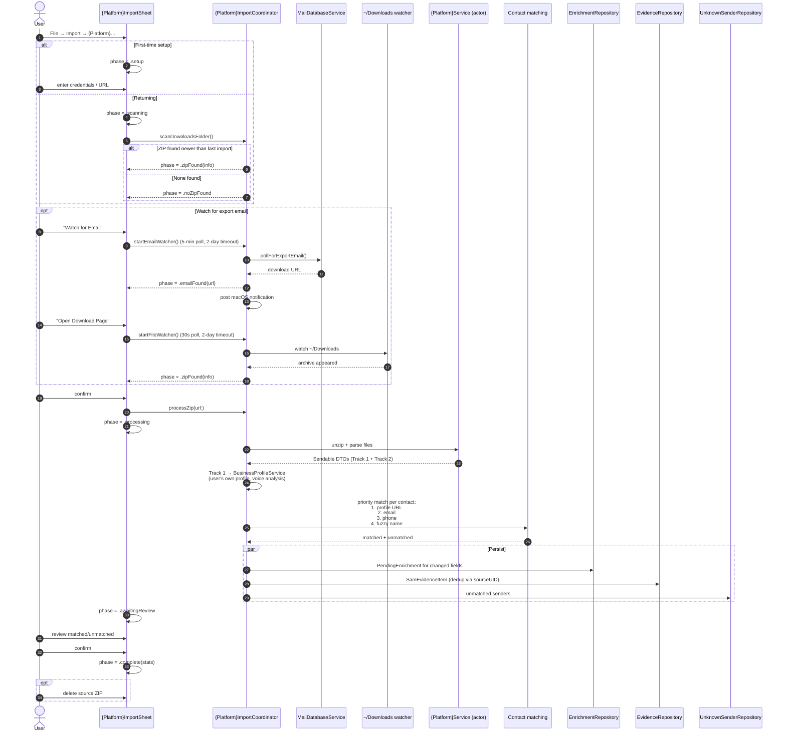
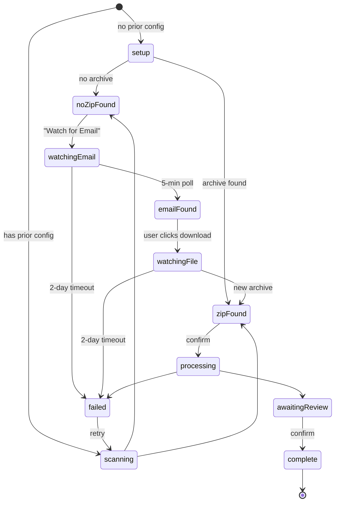

# 08 · Social Platform Import (Auto-Detection)

Async-export platforms (LinkedIn, Substack, Facebook) all share a unified pipeline: user requests data → platform emails a download link → SAM detects, parses, matches, and presents for review.

## Sequence

## Phase state machine

## Two-track model

| Track | Source | Destination | Purpose |
|---|---|---|---|
| **Track 1 — about the user** | Profile, career, skills, posts | `UserSubstackProfileDTO` etc. → `BusinessProfileService.contextFragment()` | Injected into AI specialist prompts |
| **Track 2 — about contacts** | Connections, messages, endorsements | `PendingEnrichment` + `EvidenceRepository` (matched) / `UnknownSenderRepository` (unmatched) | Enriches CRM, drives touch scoring |

## Why a unified pipeline

Three platforms, one architecture: each platform only differs in (a) file/email patterns, (b) DTO parsing. The state machine, watchers, persistence, and notifications are shared. See [context.md §5.7](../context.md) for the full adaptation checklist.

## Voice analysis

Every platform that captures the user's own posts/articles runs voice analysis (3–5 samples → `writingVoiceSummary`). `ContentAdvisorService` injects platform-appropriate voice into draft generation. Cross-platform fallback order: Substack > LinkedIn > Facebook.

## Adding a new platform

1. Define file patterns + email sender filters.
2. Copy a sheet template (`SubstackImportSheet`, `LinkedInImportSheet`, or `FacebookImportSheet`).
3. Register `{PLATFORM}_EXPORT` notification category.
4. Wire `File → Import → {Platform}` menu item.
5. Add `sam.{platform}.*` watcher persistence keys.
6. Hook `cancelAll()` into `applicationShouldTerminate`.
