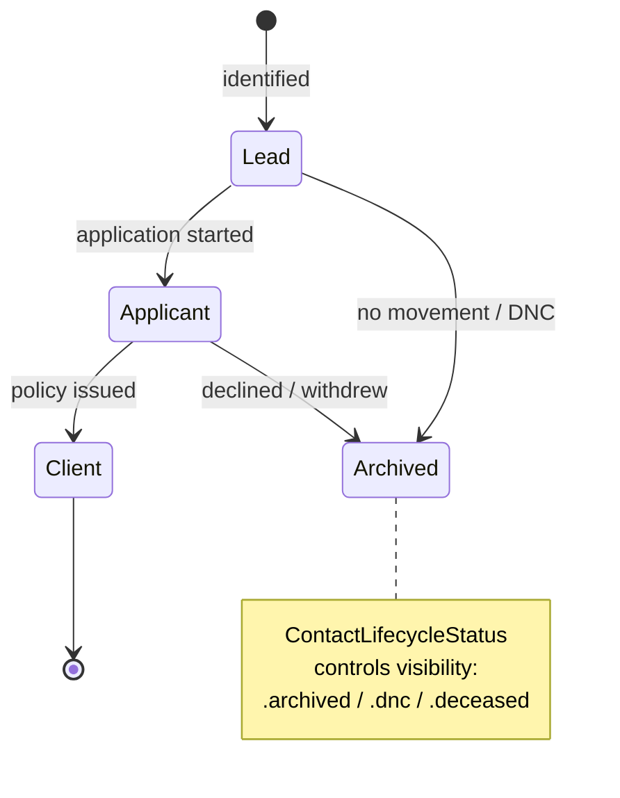
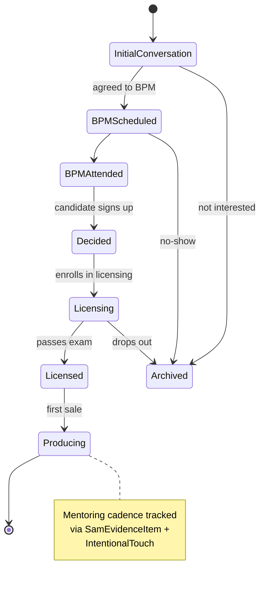
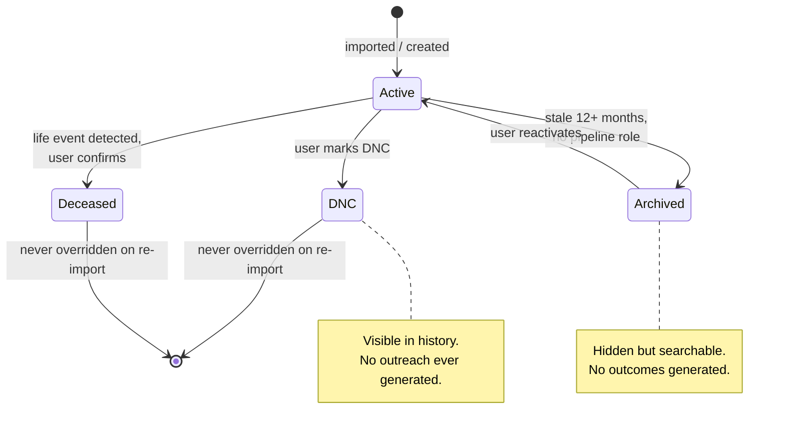
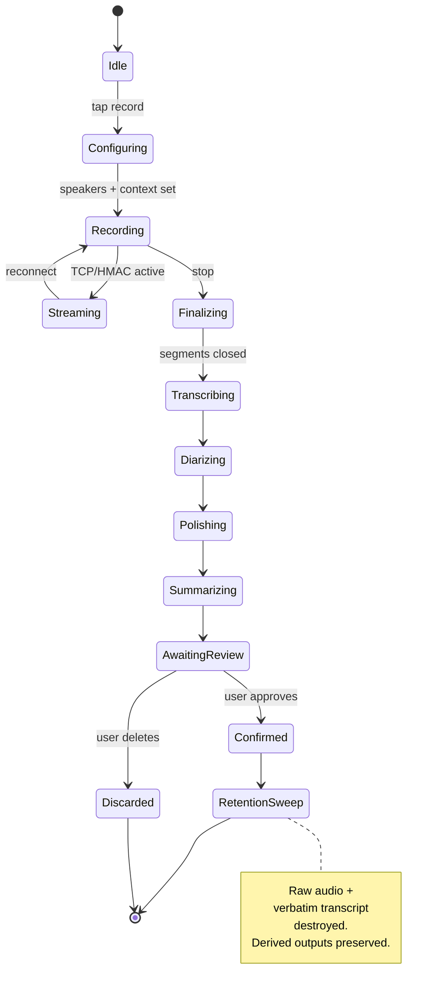
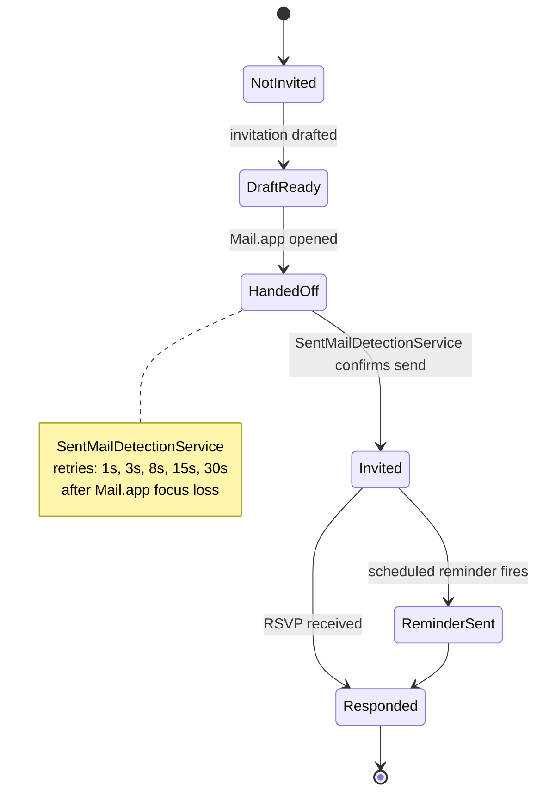
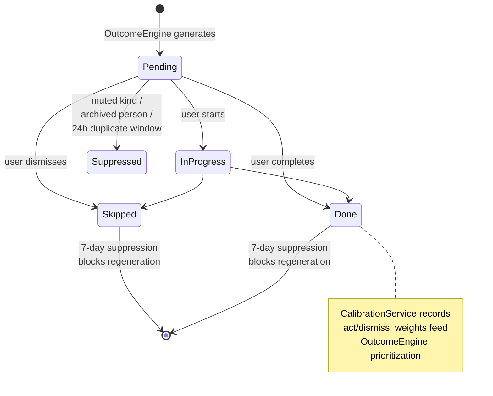

# 09 · State Machines

The discrete state lifecycles SAM tracks. Every transition is logged immutably (`StageTransition`) so velocity, time-in-stage, and stall detection can be computed historically.

## Client pipeline (Lead → Client)

## Recruiting pipeline (WFG · 7 stages)

## Contact lifecycle status

OutcomeEngine scanner #13 proactively suggests archiving Active contacts with no evidence in 12+ months and no pipeline-relevant role.

## Recording session

## Event participation

## Outcome lifecycle

## Why these are state machines (not flags)

- **Stage transitions are auditable**. `StageTransition` records every move with timestamp + note. Conversion rates and time-in-stage come from this log, not from the current `RecruitingStage`.
- **Lifecycle states gate behavior**. Coaching, outcomes, outreach drafts all consult `ContactLifecycleStatus` before generating. Never override DNC or Deceased on re-import.
- **Recording states drive UI affordances**. The phone shows different controls per state; Mac shows different review surfaces.
- **Outcome states feed calibration**. Skip/Done aren't just visual states — they update the per-kind weights that prioritize tomorrow's outcomes.
